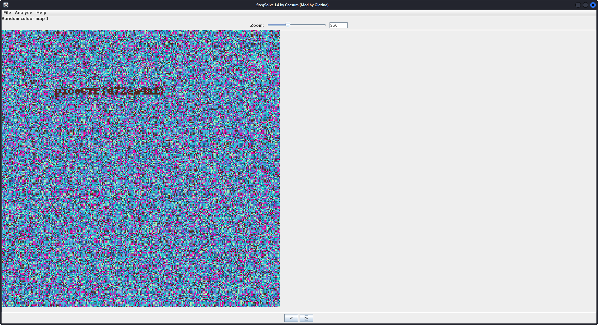
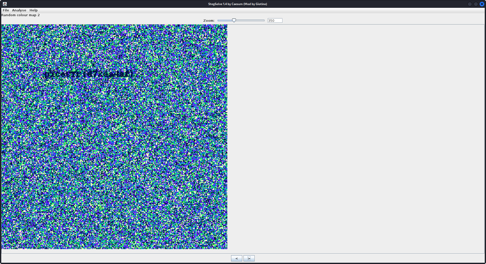
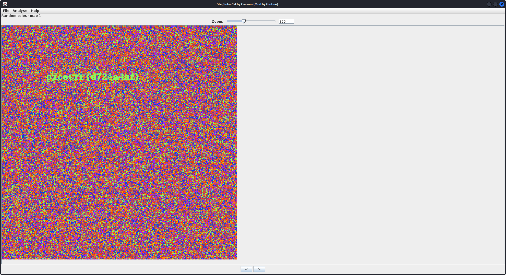

<!-- TOC start (generated with https://github.com/derlin/bitdowntoc) -->

- [Part 2: CTF](#part-2-ctf)

  - [CTF – 1 (Cryptanalysis)](#ctf-1-cryptanalysis)

    - [walkthrough](#walkthrough)

    - [steps to solve](#steps-to-solve)

    - [🚩 Flag](#-flag)

  - [CTF - 2 (Packet Analysis)](#ctf-2-packet-analysis)

    - [walkthrough](#walkthrough-1)

    - [steps to solve](#steps-to-solve-1)

    - [🚩 Flag](#-flag-1)

  - [CTF - 3 (Image Manipulation)](#ctf-3-image-manipulation)

    - [walkthrough](#walkthrough-2)

    - [steps to solve](#steps-to-solve-2)

    - [🚩 Flag](#-flag-2)

  - [CTF - 4 (Bit Shifting)](#ctf-4-bit-shifting)

    - [walkthrough](#walkthrough-3)

    - [steps to solve](#steps-to-solve-3)

      - [Method 1: use commands](#method-1-use-commands)

      - [Method 2: use python script](#method-2-use-python-script)

    - [🚩 Flag](#-flag-3)

  - [CTF - 5 (Search)](#ctf-5-search)

    - [walkthrough](#walkthrough-4)

    - [steps to solve](#steps-to-solve-4)

    - [🚩 Flag](#-flag-4)

  - [CTF - 6 (New Encryption)](#ctf-6-new-encryption)

    - [walkthrough](#walkthrough-5)

    - [steps to solve](#steps-to-solve-5)

    - [🚩 Flag](#-flag-5)

  - [CTF - 7 (Steganography)](#ctf-7-steganography)

    - [walkthrough](#walkthrough-6)

    - [steps to solve](#steps-to-solve-6)

    - [🚩 Flag](#-flag-6)

  - [CTF - 8 (Can You Help Me ?)](#ctf-8-can-you-help-me-)

    - [walkthrough](#walkthrough-7)

    - [steps to solve](#steps-to-solve-7)

    - [🚩 Flag](#-flag-7)

<!-- TOC end -->

<!-- TOC --><a name="part-2-ctf"></a>

# Part 2: CTF

<!-- TOC --><a name="ctf-1-cryptanalysis"></a>

## CTF – 1 (Cryptanalysis)

<!-- TOC --><a name="walkthrough"></a>

### walkthrough

1. it was encrypted with a substitution or transportaion techniques, we can recognize that as chunks length is not the same and all are alphabets

2. Used automatic decrypt in https://www.dcode.fr/monoalphabetic-substitution

3. - ABCDEFGHIJKLMNOPQRSTUVWXYZ

- ETAOINSHRDLCUMPGFBVKXQYJWZ (Original Encryption Alphabet) [ex: ALICE => ECRAI]

- CRLJAQPHEXTKNFDOVIGBMSYUWZ (Reciprocal Decryption Alphabet) [ex: ECRAI => ALICE]

<!-- TOC --><a name="steps-to-solve"></a>

### steps to solve

1. use [monoalphabetic-substitution tool](https://www.dcode.fr/monoalphabetic-substitution)

2. Enter ciphertext and get plaintext (with automatic decrypter)

<!-- TOC --><a name="-flag"></a>

### 🚩 Flag

> ALICE WAS BEGINNING TO GET VERY TIRED OF SITTING BY HER SISTER ON THE BANK AND OF HAVING NOTHING TO DO ONCE OR TWICE SHE HAD PEEPED INTO THE BOOK HER SISTER WAS READING BUT IT HAD NO PICTURES OR CONVERSATIONS IN IT AND WHAT IS THE USE OF A BOOK THOUGHT ALICE WITHOUT PICTURES OR CONVERSATIONS SO SHE WAS CONSIDERING IN HER OWN MIND AS WELL AS SHE COULD FOR THE DAY MADE HER FEEL VERY SLEEPY AND STUPID WHETHER THE PLEASURE OF MAKING A DAISYCHAIN WOULD BE WORTH THE TROUBLE OF GETTING UP AND PICKING THE DAISIES WHEN SUDDENLY A WHITE RABBIT WITH PINK EYES RAN CLOSE BY HER THERE WAS NOTHING SO VERY REMARKABLE IN THAT NOR DID ALICE THINK IT SO VERY MUCH OUT OF THE WAY TO HEAR THE RABBIT SAY TO ITSELF OH DEAR OH DEAR I SHALL BE TOO LATE BUT WHEN THE RABBIT ACTUALLY TOOK A WATCH OUT OF ITS WAISTCOATPOCKET AND LOOKED AT IT AND THEN HURRIED ON ALICE STARTED TO HER FEET FOR IT FLASHED ACROSS HER MIND THAT SHE HAD NEVER BEFORE SEEN A RABBIT WITH EITHER A WAISTCOATPOCKET OR A WATCH TO TAKE OUT OF IT AND BURNING WITH CURIOSITY SHE RAN ACROSS THE FIELD AFTER IT AND WAS JUST IN TIME TO SEE IT POP DOWN A LARGE RABBITHOLE UNDER THE HEDGE IN ANOTHER MOMENT DOWN WENT ALICE AFTER IT THE RABBITHOLE WENT STRAIGHT ON LIKE A TUNNEL FOR SOME WAY AND THEN DIPPED SUDDENLY DOWN SO SUDDENLY THAT ALICE HAD NOT A MOMENT TO THINK ABOUT STOPPING HERSELF BEFORE SHE FOUND HERSELF FALLING DOWN WHAT SEEMED TO BE A VERY DEEP WELL EITHER THE WELL WAS VERY DEEP OR SHE FELL VERY SLOWLY FOR SHE HAD PLENTY OF TIME AS SHE WENT DOWN TO LOOK ABOUT HER FIRST SHE TRIED TO MAKE OUT WHAT SHE WAS COMING TO BUT IT WAS TOO DARK TO SEE ANYTHING THEN SHE LOOKED AT THE SIDES OF THE WELL AND NOTICED THAT THEY WERE FILLED WITH CUPBOARDS AND BOOKSHELVES HERE AND THERE SHE SAW MAPS AND PICTURES HUNG UPON PEGS SHE TOOK DOWN A JAR FROM ONE OF THE SHELVES AS SHE PASSED IT WAS LABELED ORANGE MARMALADE BUT TO HER GREAT DISAPPOINTMENT IT WAS EMPTY SHE DID NOT LIKE TO DROP THE JAR SO MANAGED TO PUT IT INTO ONE OF THE CUPBOARDS AS SHE FELL PAST IT DOWN DOWN DOWN WOULD THE FALL NEVER COME TO AN END THERE WAS NOTHING ELSE TO DO SO ALICE SOON BEGAN TALKING TO HERSELF DINAHLL MISS ME VERY MUCH TONIGHT I SHOULD THINK DINAH WAS THE CAT I HOPE THEYLL REMEMBER HER SAUCER OF MILK AT TEATIME DINAH MY DEAR I WISH YOU WERE DOWN HERE WITH ME ALICE FELT THAT SHE WAS DOZING OFF WHEN SUDDENLY THUMP THUMP DOWN SHE CAME UPON A HEAP OF STICKS AND DRY LEAVES AND THE FALL WAS OVER ALICE WAS NOT A BIT HURT AND SHE JUMPED UP IN A MOMENT SHE LOOKED UP BUT IT WAS ALL DARK OVERHEAD BEFORE HER WAS ANOTHER LONG PASSAGE AND THE WHITE RABBIT WAS STILL IN SIGHT HURRYING DOWN IT THERE WAS NOT A MOMENT TO BE LOST AWAY WENT ALICE LIKE THE WIND AND WAS JUST IN TIME TO HEAR IT SAY AS IT TURNED A CORNER OH MY EARS AND WHISKERS HOW LATE ITS GETTING SHE WAS CLOSE BEHIND IT WHEN SHE TURNED THE CORNER BUT THE RABBIT WAS NO LONGER TO BE SEEN SHE FOUND HERSELF IN A LONG LOW HALL WHICH WAS LIT UP BY A ROW OF LAMPS HANGING FROM THE ROOF THERE WERE DOORS ALL ROUND THE HALL BUT THEY WERE ALL LOCKED AND WHEN ALICE HAD BEEN ALL THE WAY DOWN ONE SIDE AND UP THE OTHER TRYING EVERY DOOR SHE WALKED SADLY DOWN THE MIDDLE WONDERING HOW SHE WAS EVER TO GET OUT AGAIN SUDDENLY SHE CAME UPON A LITTLE TABLE ALL MADE OF SOLID GLASS THERE WAS NOTHING ON IT BUT A TINY GOLDEN KEY AND ALICES FIRST IDEA WAS THAT THIS MIGHT BELONG TO ONE OF THE DOORS OF THE HALL BUT ALAS EITHER THE LOCKS WERE TOO LARGE OR THE KEY WAS TOO SMALL BUT AT ANY RATE IT WOULD NOT OPEN ANY OF THEM HOWEVER ON THE SECOND TIME ROUND SHE CAME UPON A LOW CURTAIN SHE HAD NOT NOTICED BEFORE AND BEHIND IT WAS A LITTLE DOOR ABOUT FIFTEEN INCHES HIGH SHE TRIED THE LITTLE GOLDEN KEY IN THE LOCK AND TO HER GREAT DELIGHT IT FITTED ALICE OPENED THE DOOR AND FOUND THAT IT LED INTO A SMALL PASSAGE NOT MUCH LARGER THAN A RATHOLE SHE KNELT DOWN AND LOOKED ALONG THE PASSAGE INTO THE LOVELIEST GARDEN YOU EVER SAW HOW SHE LONGED TO GET OUT OF THAT DARK HALL AND WANDER ABOUT AMONG THOSE BEDS OF BRIGHT FLOWERS AND THOSE COOL FOUNTAINS BUT SHE COULD NOT EVEN GET HER HEAD THROUGH THE DOORWAY OH SAID ALICE HOW I WISH I COULD SHUT UP LIKE A TELESCOPE I THINK I COULD IF I ONLY KNEW HOW TO BEGIN ALICE WENT BACK TO THE TABLE HALF HOPING SHE MIGHT FIND ANOTHER KEY ON IT OR AT ANY RATE A BOOK OF RULES FOR SHUTTING PEOPLE UP LIKE TELESCOPES THIS TIME SHE FOUND A LITTLE BOTTLE ON IT WHICH CERTAINLY WAS NOT HERE BEFORE SAID ALICE AND TIED ROUND THE NECK OF THE BOTTLE WAS A PAPER LABEL WITH THE WORDS DRINK ME BEAUTIFULLY PRINTED ON IT IN LARGE LETTERS NO ILL LOOK FIRST SHE SAID AND SEE WHETHER ITS MARKED POISON OR NOT FOR SHE HAD NEVER FORGOTTEN THAT IF YOU DRINK FROM A BOTTLE MARKED POISON IT IS ALMOST CERTAIN TO DISAGREE WITH YOU SOONER OR LATER HOWEVER THIS BOTTLE WAS NOT MARKED POISON SO ALICE VENTURED TO TASTE IT AND FINDING IT VERY NICE IT HAD A SORT OF MIXED FLAVOR OF CHERRYTART CUSTARD PINEAPPLE ROAST TURKEY TOFFY AND HOT BUTTERED TOAST SHE VERY SOON FINISHED IT OFF WHAT A CURIOUS FEELING SAID ALICE I MUST BE SHUTTING UP LIKE A TELESCOPE AND SO IT WAS INDEED SHE WAS NOW ONLY TEN INCHES HIGH AND HER FACE BRIGHTENED UP AT THE THOUGHT THAT SHE WAS NOW THE RIGHT SIZE FOR GOING THROUGH THE LITTLE DOOR INTO THAT LOVELY GARDEN AFTER AWHILE FINDING THAT NOTHING MORE HAPPENED SHE DECIDED ON GOING INTO THE GARDEN AT ONCE BUT ALAS FOR POOR ALICE WHEN SHE GOT TO THE DOOR SHE FOUND SHE HAD FORGOTTEN THE LITTLE GOLDEN KEY AND WHEN SHE WENT BACK TO THE TABLE FOR IT SHE FOUND SHE COULD NOT POSSIBLY REACH IT SHE COULD SEE IT QUITE PLAINLY THROUGH THE GLASS AND SHE TRIED HER BEST TO CLIMB UP ONE OF THE LEGS OF THE TABLE BUT IT WAS TOO SLIPPERY AND WHEN SHE HAD TIRED HERSELF OUT WITH TRYING THE POOR LITTLE THING SAT DOWN AND CRIED COME THERES NO USE IN CRYING LIKE THAT SAID ALICE TO HERSELF RATHER SHARPLY I ADVISE YOU TO LEAVE OFF THIS MINUTE SHE GENERALLY GAVE HERSELF VERY GOOD ADVICE THOUGH SHE VERY SELDOM FOLLOWED IT AND SOMETIMES SHE SCOLDED HERSELF SO SEVERELY AS TO BRING TEARS INTO HER EYES SOON HER EYE FELL ON A LITTLE GLASS BOX THAT WAS LYING UNDER THE TABLE SHE OPENED IT AND FOUND IN IT A VERY SMALL CAKE ON WHICH THE WORDS EAT ME WERE BEAUTIFULLY MARKED IN CURRANTS WELL ILL EAT IT SAID ALICE AND IF IT MAKES ME GROW LARGER I CAN REACH THE KEY AND IF IT MAKES ME GROW SMALLER I CAN CREEP UNDER THE DOOR SO EITHER WAY ILL GET INTO THE GARDEN AND I DONT CARE WHICH HAPPENS SHE ATE A LITTLE BIT AND SAID ANXIOUSLY TO HERSELF WHICH WAY WHICH WAY HOLDING HER HAND ON THE TOP OF HER HEAD TO FEEL WHICH WAY SHE WAS GROWING AND SHE WAS QUITE SURPRISED TO FIND THAT SHE REMAINED THE SAME SIZE SO SHE SET TO WORK AND VERY SOON FINISHED OFF THE CAKE

<!-- TOC --><a name="ctf-2-packet-analysis"></a>

## CTF - 2 (Packet Analysis)

<!-- TOC --><a name="walkthrough-1"></a>

### walkthrough

1. It is `.pcapng`, se open any packet analysis tool and analyze the given `logs.pcapng` file

2. filter protocols to narrow down your search (common ports like HTTP (80), HTTPS (443), or FTP (21))

3. Used wireshark search with regular expression `CMPN\{([^{}]+)\}|picoCTF\{([^{}]+)\}|fastctf\{([^{}]+)\}` for the expected flags

Actually, i found another easier way 😃

as most of packets in the given `.pcapng` file are with protocol http not https, then data (if any sent) will not be encrypted

so we can use `strings` command

1. Open terminal in the directory where `logs.pcapng` file exist

2. `strings packets.pcapng | tr -d " " | grep -E "CMPN\{([^{}]+)\}|picoCTF\{([^{}]+)\}|fastctf\{([^{}]+)\}"`

tried previous command but no result was found, so i tried next one

3.  `strings packets.pcapng | grep -E "\{"`

found `cvpbPGS{c33xno00_1_f33_h_qrnqorrs}` which looks like a flag, but it is not one of the three expected flag structure

4. but it looks like `picoCTF{some_text}`

oooh, it is encrypted using ROT13

so the flag is `picoCTF{p33kab00_1_s33_u_deadbeef}`

<!-- TOC --><a name="steps-to-solve-1"></a>

### steps to solve

1. Open terminal in the directory where `logs.pcapng` file exist

2. use command: `strings packets.pcapng | grep -E "\{"`

3. decrypt previous command output with ROT13, and get the flag

<!-- TOC --><a name="-flag-1"></a>

### 🚩 Flag

> picoCTF{p33kab00_1_s33_u_deadbeef}

<!-- TOC --><a name="ctf-3-image-manipulation"></a>

## CTF - 3 (Image Manipulation)

<!-- TOC --><a name="walkthrough-2"></a>

### walkthrough

1. Opened an image editor tool (ex: https://www.photopea.com/)

2. put first.png and second.png in different layers

3. made first.png in the upper layer with 50% transparency
   

4. downloaded `stegsolve` tool from (https://github.com/Giotino/stegsolve)

5. copied tool file to the same directory of the new manipulated image

6. `java -jar StegSolve-1.4.jar`

7. Try different color sets till you see the flag
     

<!-- TOC --><a name="steps-to-solve-2"></a>

### steps to solve

Check walkthrough.

<!-- TOC --><a name="-flag-2"></a>

### 🚩 Flag

The final results lack clarity, hence the flag is almost:

> picoCTF{d72ea4af}

<!-- TOC --><a name="ctf-4-bit-shifting"></a>

## CTF - 4 (Bit Shifting)

<!-- TOC --><a name="walkthrough-3"></a>

### walkthrough

1. Get file data in binary representation (you can use `xxd -b bits.txt`)

Actually i 'll try to do it using python script

Ok, python script worked for me, but what i just did is _"making a mountain out of a molehill"_ 😦

if you think of it each char is stored as 1 byte, so at most the shift will be 7 bit at any direction to see valid characters

after seeing valid characters text may be shifted by some characters (you will recognize that easily by looking at the beginning and end)

<!-- TOC --><a name="steps-to-solve-3"></a>

### steps to solve

<!-- TOC --><a name="method-1-use-commands"></a>

#### Method 1: use commands

which Unfortunately i didn't 😦

<!-- TOC --><a name="method-2-use-python-script"></a>

#### Method 2: use python script

In the next script, update `PATH` to the file directory and file should be named bits.txt

Now, use it

```py


PATH = ""  # add file path here if file not found


def  read_file_binary(filename):

with  open(filename, 'rb') as file:

data = file.read()

# Convert each byte into its binary representation and concatenate them into a single string

binary_string = ''.join(format(byte, '08b') for byte in data)

# Convert the binary string into a list of individual bits

return [bit for bit in binary_string]


def  print_binary_data(data, byte_delimiter=''):

for bit in data:

print(bit, end=byte_delimiter) # Print each bit

print() # Print a newline at the end


def  roll_left(data, shift_amount):

# Calculate the effective shift amount (in case it's larger than the length of the data)

shift_amount %= len(data)


# Roll the data to the left by the shift amount

rolled_data = data[shift_amount:] + data[:shift_amount]


return rolled_data


def  roll_right(data, shift_amount):

# Calculate the effective shift amount (in case it's larger than the length of the data)

shift_amount %= len(data)


# Roll the data to the right by the shift amount

rolled_data = data[-shift_amount:] + data[:-shift_amount]


return rolled_data


def  binary_to_string(binary_data):

# Convert the list of bits to a string

return  ''.join(chr(int(''.join(bit), 2)) for bit in  zip(*[iter(binary_data)]*8))


def  brute_force_roll(binary_data):

for i in  range(1, len(binary_data) + 1):

# Roll left and right

rolled_left = roll_left(binary_data, i)

rolled_right = roll_right(binary_data, i)


# Convert binary data to string

rolled_left_str = ''.join(rolled_left)

rolled_right_str = ''.join(rolled_right)


# Print rolled data

print(f"--------------------")

print(f"Shift amount: {i}")

print(f"--------------------")

print("Rolled left:", binary_to_string(rolled_left_str))

print("Rolled right:", binary_to_string(rolled_right_str))

print() # Add a blank line between iterations

input()


def  main():

filename = "bits.txt"

binary_data = read_file_binary(filename)

print("Original")

print_binary_data(binary_data)

brute_force_roll(binary_data)

print(len(binary_data))


if  __name__ == "__main__":

main()


```

<!-- TOC --><a name="-flag-3"></a>

### 🚩 Flag

> fastctf{a_bit_tricky}

<!-- TOC --><a name="ctf-5-search"></a>

## CTF - 5 (Search)

<!-- TOC --><a name="walkthrough-4"></a>

### walkthrough

1. Open terminal in the directory where logs file exist

2. Use command `grep -E "CMPN\{([^{}]+)\}|picoCTF\{([^{}]+)\}|fastctf\{([^{}]+)\}" logs`

which will search for possible flag patterns

<!-- TOC --><a name="steps-to-solve-4"></a>

### steps to solve

check walkthrough.

<!-- TOC --><a name="-flag-4"></a>

### 🚩 Flag

> picoCTF{grep_is_good_to_find_things_dba08a45}

<!-- TOC --><a name="ctf-6-new-encryption"></a>

## CTF - 6 (New Encryption)

<!-- TOC --><a name="walkthrough-5"></a>

### walkthrough

1. analyze the encryption code

2. reverse each operation

3. perform operations in the opposite order

4. test and solve bugs

5. happy hacking 😃!

<!-- TOC --><a name="steps-to-solve-5"></a>

### steps to solve

check walkthrough.

- for the python code:

```py

import string


START = ord("a")

CHARSET = string.ascii_lowercase[:16]


def  decode_b16(cipher):

decoded = ""


for i in  range(0, len(cipher), 2):

char1Index = int("{0:04b}".format(CHARSET.index(cipher[i])),2)

char2Index = int("{0:04b}".format(CHARSET.index(cipher[i+1])),2)

decoded += chr(char1Index * 16 + char2Index)

return decoded


def  caesar_deshift(c,k):

return CHARSET[((CHARSET.index(c) - 1) - ord(k) + 2 * START + len(CHARSET)) % len(CHARSET)]


def  decrypt(cipher, key):

b16 = ""

for i, c in  enumerate(cipher):

b16 += caesar_deshift(c, key[i % len(key)])


return decode_b16(b16)


def  brute_force_decrypt_oneLetterKey(ciphertext):

for letter in string.ascii_lowercase:

decrypted_text = decrypt(ciphertext, letter)

print(f"Key: {letter}, Decrypted text: {decrypted_text}")


cipher = "jikmkjgekjkckjkbknkjlhgekflgkjgekbkfkpknkcklgekfgekbkdlkkjgcgejlkjgekckjkjkigelikdgekfkhligekkkflhligc"

brute_force_decrypt_oneLetterKey(cipher)

```

<!-- TOC --><a name="-flag-5"></a>

### 🚩 Flag

> The enemies are making a move. We need to act fast.

<!-- TOC --><a name="ctf-7-steganography"></a>

## CTF - 7 (Steganography)

<!-- TOC --><a name="walkthrough-6"></a>

### walkthrough

1. I tried to check the file type `file pepo_evil.jpg`, but nothing suspicious

2. Tried to use exiftool `exiftool pepo_evil.jpg`, but found nothing suspicious in metadata

3. Tried to use steghide `steghide info pepo_evil.jpg`, but it asks for a password

4. Tried to use binwalk `binwalk pepo_evil.jpg`, but nothing found

5. Tried online tools

a. (https://www.aperisolve.com/) uploaded image and it give me common password for it `HIDING`

6. Tried steghide again `steghide extract -sf pepo_evil.jpg` with HIDING passphrase and the flag is extracted

<!-- TOC --><a name="steps-to-solve-6"></a>

### steps to solve

1. search for any suspicious word for the password (like `HIDING` 😃)

2. use command `steghide extract -sf pepo_evil.jpg`, enter password: `HIDING`

3. get the flag

<!-- TOC --><a name="-flag-6"></a>

### 🚩 Flag

> CMPN{Spring2024}

<!-- TOC --><a name="ctf-8-can-you-help-me-"></a>

## CTF - 8 (Can You Help Me ?)

<!-- TOC --><a name="walkthrough-7"></a>

### walkthrough

when i opened the file, i notice that it contains morse code

1. use morse code online decodor like (https://morsecode.world/international/decoder/audio-decoder-adaptive.html)

2. we got "THE RUSSIAT TERRORISTS ARE THE ONES WHO STARTED THIS, THEY ARE THE KEY. PLEASE YOU MUST EXTRACT ME", i thought that it is the key but why it says "PLEASE YOU MUST EXTRACT ME"!! 🤔
3. Tried to open the voice file in txt type (used Notepad++), hmmm found somthing appended
4. there is some encrypted text and hint (Nihilist_cipher)
5. tried to use https://www.dcode.fr/nihilist-cipher to decrypt it
6. the text we got from the audio file in step-2 says also "RUSSIAT .. THEY ARE THE KEY", so i used "RUSSIAT" as the key
7. now i need the keyword used in the Polybius square tried many suspicious words (RUSSIAT, TERRORISTS, lastcall, etc..), oooh the keyword is in the appended link, it is "polybius"
   entered it, and the tool suggested

   - POLYBIUSACDEFGHKMNQRTVWXZ (-J)
   - POLYBIUSACDEFGHJKMNQRTWXZ (-V)
   - POLYBIUSACDEFGHJKMNQRTVXZ (-W)
   - POLYBIUSACDEFGHJMNQRTVWXZ (-K)
   - POLYBIUSACDEFGHJKMNRTVWXZ (-Q)
   - POLYBIUSACDEFGHJKMNQRTVWX (-Z)

8. Tried each of them and got the flag 😃

<!-- TOC --><a name="steps-to-solve-7"></a>

### steps to solve

check walkthrough.

<!-- TOC --><a name="-flag-7"></a>

### 🚩 Flag

> THANKYOUFORSAVINGMETHEFLAGISMOSCOW

OR

> MOSCOW
